```
╔═════════════════════════════════════════════════════════════════════╗
║                                                                     ║
║        ▓▓▓▓▓▓╗ ▓▓╗▓▓▓▓▓▓▓╗▓▓▓▓▓▓╗  ▓▓▓▓▓▓  ▓▓▓▓▓▓▓╗▓▓▓▓▓▓▓▓╗        ║
║        ▓▓╔══▓▓╗▓▓║▓▓╔════╝▓▓╔══▓▓╗▓▓╔═══▓▓╗▓▓╔════╝╚══▓▓╔══╝        ║
║        ▓▓▓▓▓▓╔╝▓▓║▓▓▓▓▓╗  ▓▓▓▓▓▓╔╝▓▓║   ▓▓║▓▓▓▓▓▓▓╗   ▓▓║           ║
║        ▓▓╔══▓▓╗▓▓║▓▓╔══╝  ▓▓╔══▓▓╗▓▓║   ▓▓║╚════▓▓║   ▓▓║           ║
║        ▓▓▓▓▓▓╔╝▓▓║▓▓║     ▓▓║  ▓▓║╚▓▓▓▓▓▓╔╝▓▓▓▓▓▓▓║   ▓▓║           ║
║        ╚═════╝ ╚═╝╚═╝     ╚═╝  ╚═╝ ╚═════╝ ╚══════╝   ╚═╝           ║
║                                                                     ║
║                    The Bridge Between Realms                        ║
║          Connecting Local Development to Remote Services            ║
║                                                                     ║
╚═════════════════════════════════════════════════════════════════════╝
```
Bifrost is an SSH tunneling tool that creates secure bridges between your local development environment and remote services. 
Named after the bridge between Midgard and Asgard in Norse mythology, Bifrost bridges your local and remote environments by 
automating the creation and management of bidirectional SSH tunnels. This makes it easy to:

- **Access remote services locally**: Forward remote service ports to your local machine (using SSH `-L` tunnels)
- **Expose local services remotely**: Make your local development services accessible from remote hosts (using SSH `-R` reverse tunnels)
- **Simplify development workflows**: Connect to remote databases, APIs, and services without complex networking or VPN configurations
- **Maintain persistent connections**: Automatically reconnect tunnels if connections drop using `autossh`

## Key Features

- 🔒 **Secure SSH tunneling** with automatic reconnection
- 🔄 **Bidirectional tunnels** (both local forward and reverse)
- 📝 **YAML-based configuration** for easy service management
- 🐳 **Docker-integrated** for simple toolchains and seamless container networking
- 🎯 **Multiple port mappings** per service
- 🌐 **Network aliases** for service discovery
- ⚡ **Auto-network creation** - runs directly from config without manual setup

## How It Works

1. The Bifrost container connects to a remote host (e.g., EC2 instance) via SSH
2. It creates **local forward tunnels (-L)** for services listed in the `remote` section, making remote services accessible locally
3. It creates **reverse tunnels (-R)** for services listed in the `local` section, exposing local services to the remote host
4. **Network aliases are automatically assigned** to the Bifrost container matching the names of remote services (e.g., `payments`, `postgres`), so other Docker services can connect using service names instead of localhost ports
5. Your local applications use the same connection strings whether services run locally or remotely—just start or stop Bifrost to switch between them

## Architecture Diagram

```mermaid
graph TB
    subgraph "Local Machine"
        subgraph "Docker Network"
            LocalApp["Local App Container<br/>(Your Service)"]
            LocalService["Local Service<br/>(e.g., web-gateway:8080)"]
            Bifrost["🌉 Bifrost Container<br/>(SSH Client)<br/>🏷️ Aliases: payments, postgres"]
        end
    end
    
    subgraph "SSH Tunnel"
        SSHTunnel["Encrypted SSH Connection<br/>(autossh)"]
    end
    
    subgraph "Remote Server (e.g., EC2)"
        SSHServer["SSH Server<br/>(Port 22)<br/>⚠️ Outside Docker Network"]
        RemoteHost["Remote Host<br/>(localhost)"]
        
        subgraph "Remote Docker Network"
            RemoteDB["Remote Database Container<br/>(PostgreSQL)<br/>Internal: 5432<br/>📤 Exposed: 5432→host"]
            RemoteAPI["Remote API Container<br/>(payments)<br/>Internal: 9001<br/>📤 Exposed: 9001→host"]
            RemoteApp["Remote App Container<br/>(Accesses local services)<br/>Internal: 3000<br/>📤 Exposed: 3000→host"]
        end
    end
    
    %% Remote Tunnels (Forward -L)
    LocalApp -->|"DNS resolves 'payments'<br/>to Bifrost container"| Bifrost
    Bifrost -->|"Local Forward Tunnel (-L)<br/>0.0.0.0:9001 → localhost:9001"| SSHTunnel
    SSHTunnel --> SSHServer
    SSHServer --> RemoteHost
    RemoteHost -->|"Port 9001<br/>exposed to host"| RemoteAPI
    
    Bifrost -->|"Local Forward Tunnel (-L)<br/>0.0.0.0:5432 → localhost:5432"| SSHTunnel
    RemoteHost -->|"Port 5432<br/>exposed to host"| RemoteDB
    
    %% Reverse Tunnels (-R)
    LocalService -->|"Listening on<br/>0.0.0.0:8080"| Bifrost
    Bifrost -->|"Reverse Tunnel (-R)<br/>localhost:8080 ← 0.0.0.0:8080"| SSHTunnel
    SSHServer --> RemoteHost
    RemoteHost -->|"Access via<br/>localhost:8080"| RemoteApp
    
    style Bifrost fill:#ffd6d6,stroke:#ffb3ba,stroke-width:3px,color:#2c2c2c
    style SSHTunnel fill:#d4e9ff,stroke:#a8d1ff,stroke-width:2px,color:#2c2c2c
    style SSHServer fill:#ffe4e1,stroke:#ffb3ba,stroke-width:2px,color:#2c2c2c
    style RemoteHost fill:#f5f5f5,stroke:#d0d0d0,stroke-width:2px,color:#2c2c2c
    style LocalApp fill:#e3f5ea,stroke:#b8dfc8,color:#2c2c2c
    style LocalService fill:#e3f5ea,stroke:#b8dfc8,color:#2c2c2c
    style RemoteAPI fill:#fffde3,stroke:#f5edb3,color:#2c2c2c
    style RemoteDB fill:#fffde3,stroke:#f5edb3,color:#2c2c2c
    style RemoteApp fill:#fffde3,stroke:#f5edb3,color:#2c2c2c
```



### Tunnel Flow Explained

**Remote Services (Forward Tunnels `-L`):**
```
Local App → payments:9001 → Bifrost Container → SSH Tunnel → SSH Server → Remote Host (localhost:9001) → Remote Container
           (network alias)    (0.0.0.0:9001)      (encrypted)   (outside docker)    (exposed port)        (internal port)
```

**Local Services (Reverse Tunnels `-R`):**
```
Remote Container → localhost:8080 → Remote Host → SSH Server → SSH Tunnel → Bifrost Container → Local Service
(in docker network) (exposed port)   (host port)   (outside docker) (encrypted)   (0.0.0.0:8080)      (web-gateway:8080)
```

**Important:** Remote services must expose their ports to the host (using Docker's `-p` flag or `ports:` in docker-compose) because the SSH server runs on the host, not inside the Docker network. The SSH tunnel connects to `localhost` on the remote host, which then routes to the exposed container ports.

### Network Aliases: Seamless Service Discovery

One of Bifrost's most powerful features is **DNS aliasing** through Docker network aliases. 
The Bifrost container automatically takes on the DNS names of all remote services it tunnels to.

**How it works:**

When you define remote services in `config.yml`:
```yaml
remote:
  payments:
    local_to_remote_ports:
      "9001": "9001"
  postgres:
    local_to_remote_ports:
      "5432": "5432"
```

Bifrost is assigned network aliases `payments` and `postgres` in the Docker network. This means:

```
payments:9001  →  resolves to Bifrost container IP  →  tunneled to remote payments service
postgres:5432  →  resolves to Bifrost container IP  →  tunneled to remote postgres service
```

**Why this matters:**

Your local services can use the **same connection strings** whether the service is running locally or remotely:

```javascript
// This connection string works for both scenarios:
const dbUrl = 'postgresql://postgres:5432/mydb';

// Scenario 1: postgres container running locally
//   → DNS resolves 'postgres' to local postgres container

// Scenario 2: postgres running remotely with Bifrost
//   → DNS resolves 'postgres' to Bifrost container
//   → Bifrost tunnels to remote postgres
```

**No configuration changes needed!** Switch between local and remote services by simply starting or stopping Bifrost—your application code remains unchanged.

### Use Cases

- **Database Access**: Connect to remote PostgreSQL, MySQL, or MongoDB instances as if they were running locally
- **API Development**: Access staging/production APIs from your local development environment
- **Webhook Testing**: Expose local services to receive webhooks from external services
- **Microservices Development**: Access remote microservices while developing locally
- **Secure Remote Access**: Bypass firewalls and access services in private networks

## Configuration

### config.yml

Define remote services in the root `config.yml` file:

```yaml
remote:
  payments:
    local_to_remote_ports:
      "9001": "9001"
      "4000": "4000"  # Multiple ports supported
```

**Format:**
- `local_to_remote_ports`: A map of local ports to remote ports (required)
  - Each entry maps a local port (key) to a remote port (value)
  - Multiple port mappings are supported per service
- `local_host`: The interface to bind on locally (optional, defaults to `0.0.0.0`)
- `remote_host`: The host on the EC2 instance to forward to (optional, defaults to `localhost`)

**Example with custom hosts:**
```yaml
remote:
  rabbitmq:
    local_host: rabbitmq      # Override default
    remote_host: 0.0.0.0      # Override default
    local_to_remote_ports:
      "5672": "5672"
```

**Example with multiple ports:**
```yaml
remote:
  grafana:
    local_to_remote_ports:
      "3000": "3000"
      "3001": "3001"
      "9090": "9090"
```

### Local Services (Reverse Tunnels)

For services running locally that need to be accessible from the EC2 instance:

```yaml
local:
  web-gateway:
    local_to_remote_ports:
      "8080": "8080"
```

**Defaults for local section:**
- `local_host`: Defaults to `0.0.0.0`
- `remote_host`: Defaults to `localhost`

### SSH Configuration

Configure the SSH connection to the remote server:

```yaml
ssh:
  user: ec2-user
  host: ec2-12-34-56-78.compute.amazonaws.com
  port: 22
  identity_file: ~/.ssh/id_rsa
```

**Required fields:**
- `user`: SSH username for the remote server
- `host`: Hostname or IP address of the remote server
- `port`: SSH port (typically 22)
- `identity_file`: Path to your SSH private key file

### Docker Network Configuration

Configure the Docker network where your local services are running:

```yaml
docker:
  network:
    name: common
    external: true
```

**Fields:**
- `name`: Name of the Docker network (required)
- `external`: Whether the network already exists (required)
  - `true`: The network is declared elsewhere (typical use case) - Bifrost joins the existing network where your local services are running
  - `false`: Bifrost will create the network if it doesn't exist (useful for standalone testing)

**Understanding the Network:**

The `docker.network` configuration specifies **which Docker network your local services are on**. This is the network where:
- Your application containers are running (e.g., your web app, worker services)
- These services need to connect to remote services (e.g., remote databases, APIs)

When Bifrost joins this network, it becomes accessible via network aliases (e.g., `postgres`, `payments`), allowing your local services to connect to remote services transparently.

**Typical Usage (external: true):**

Most commonly, you have an existing Docker Compose setup with a network:

```yaml
# Your existing docker-compose.yml
version: '3.8'
services:
  web-app:
    image: myapp:latest
    networks:
      - common

networks:
  common:
    name: common
```

Your Bifrost config should reference this **same network**:

```yaml
docker:
  network:
    name: common
    external: true  # Network already exists from your docker-compose.yml
```

Now `web-app` can connect to remote services via Bifrost using service names like `postgres:5432` or `payments:9001`.

**Standalone Usage (external: false):**

If you're running Bifrost standalone without other Docker Compose services (e.g., for testing or direct access):

```yaml
docker:
  network:
    name: bifrost-network
    external: false  # Bifrost creates its own network
```

This allows Bifrost to run independently without requiring pre-existing network setup.

### Complete Configuration Example

Here's a full `config.yml` example for typical usage:

```yaml
remote:
  postgres:
    local_to_remote_ports:
      "5432": "5432"
  payments:
    local_to_remote_ports:
      "9001": "9001"

local:
  web-gateway:
    local_to_remote_ports:
      "8080": "8080"

ssh:
  user: ec2-user
  host: ec2-12-34-56-78.compute.amazonaws.com
  port: 22
  identity_file: ~/.ssh/id_rsa

docker:
  network:
    name: common
    external: true  # Join existing network where your services run
```

### Generating the Docker Compose File

The `docker-compose.bifrost.yml` file is **generated** from the template and should not be edited manually.

To generate/update it:

```bash
make config
```

This script:
1. Reads `config.yml`
2. Extracts service names from the `remote` section
3. Generates `docker-compose.bifrost.yml` with:
   - Network aliases for each remote service
   - Port mappings for each service

## Usage

After generating the config:

```bash
make [bifrost|restart]
```

Now other services can connect to remote services using their service names:
- `payments:9001` instead of `localhost:9001`
- `grafana:3000` instead of `localhost:3000`
- etc.

## Files

- `Dockerfile` - Container images with required tools
- `run.sh` - Main script that creates SSH tunnels based on config.yml
- `config.yml` - Service configuration file (define your tunnels here)
- `config-template.yml` - Template for creating your config.yml
- `config.schema.json` - JSON schema for validating configuration
- `docker-compose.bifrost.yml` - Generated Docker Compose file for Bifrost service
- `docker-compose.heimdall.yml` - Heimdall (Bifrost generator) service configuration
- `docker-compose.template.yml` - Template for generating compose files
- `generate.sh` - Script to generate docker-compose.bifrost.yml from config
- `Makefile` - Make targets for Bifrost configuration and management
- `embeddable.mk` - Makefile that can be embedded in other projects

## Requirements

- Docker and Docker Compose
- SSH access to a remote host
- SSH private key for authentication
